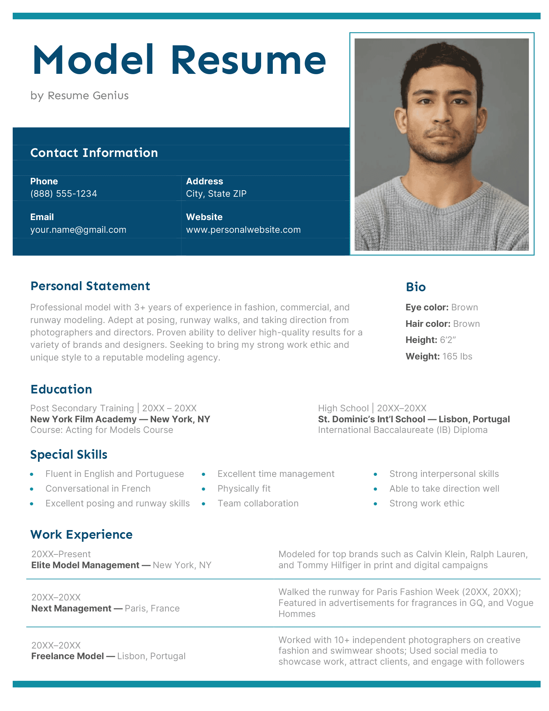

Hauràs de fer una web sobre tu mateix. Aquesta web tindrà com a mínim 4 pàgines.

- Hauràs d'utilitzar HTML i CSS. i crear les carpetes:

- img: per guardar les imatges

- css: pel CSS de les pàgines

- audio: per guardar els arxius d'MP3

- video: per guardar els arxius d'MP4

- Es puntuarà l'estètica de la pàgina en un 50%.

- L'alta usabilitat de la web 10%.

- La utilització de nous elements no explicats a classe un 20%.

- La utilització de la majoria dels elements explicats a classe 20%.

Pàgina 1 Principal títol amb el teu NOM: Aquesta pàgina parlarà de qui ets tu, els teus amics, família, la teva ciutat, la teva cultura, etc. Tindràs un menú principal a les altres tres pàgines. Això ho pots fer amb links o botons.Hauràs d'afegir un video teu no més llarg de 30 segons on expliquis qui ets. El video estarà al teu drive amb un link.

Pàgina 2: Títol Curriculum Vitae hauràs de fer un currículum com el de la foto model.png Pots inventar la informació que no tinguis. Intenta que la pàgina sigui molt semblant a la foto.

Pàgina 3: Títol: Les meves aficions. Per exemple si t'agrada el futbol posa una foto del teu equip, història, jugadors, afició amb fotos i links. Hauràs de posar un audio de música que a tu t'agradi en mp3 .

Pàgina 4: Títol La meva futura feina. Els estudis que estàs cursant i si faràs algun tipus d'estudis complementaris quan terminis el Grau. On t'agradaria treballar i visualitza el teu futur professional.

